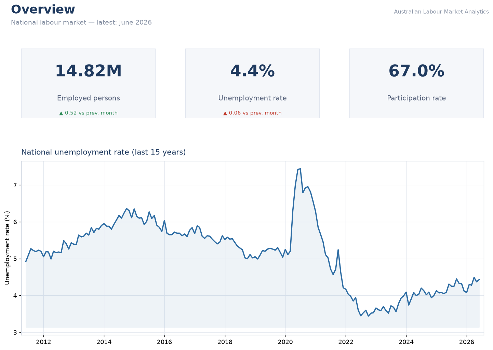

# Australian Labour Market Analytics

End-to-end analytics on real Australian Bureau of Statistics Labour Force data:
ingested from the ABS Data API with Python, modelled into a star schema with
**dbt** on **SQL Server**, and delivered as a four-page **Power BI** report and a
**Power Query-driven Excel workbook**.

**Stack:** Python · dbt (`dbt-sqlserver`) · SQL Server · T-SQL · Power BI · DAX · Excel / Power Query · Docker

**It runs for $0.** SQL Server Developer edition in a container, an open
government API with no key, and no cloud account. Clone it and it builds.

```bash
docker compose up -d      # local warehouse
py -3 run_pipeline.py     # ABS API -> raw -> dbt build -> Excel export
```

That is the whole setup. There is no secret to obtain and nothing to provision.

> **On the Azure SQL that used to be here.** v1 of this project genuinely ran on
> Azure SQL, and the write-up said so. That instance was then decommissioned on
> purpose — a portfolio project should not carry a monthly bill — which left the
> repo describing a pipeline instead of being one: cloning it failed at step
> three on a missing connection string. v2 rebuilt it on a local warehouse so it
> runs again for anyone. The T-SQL dialect is deliberately the same one Azure SQL
> and Fabric speak, so retargeting a cloud warehouse is a dbt profile change, not
> a rewrite — see the `azure` target in `dbt/profiles.yml`. That path is
> documented, not required.

---

## Pipeline

```
ABS Data API
     │  scripts/extract.py            (no API key)
     ▼
data/raw/*.csv                        ABS response, saved verbatim
     │  scripts/load_raw.py
     ▼
raw.lf_observations                   landed unmodified, no cleaning
raw.labour_account_observations
     │  dbt
     ▼
staging.stg_labour_force              typed, keyed, deduplicated
     │
     ▼
core.dim_date  core.dim_series  core.fct_labour_force        ← the star schema
     │
     ▼
mart.v_national_overview      mart.v_unemployment_by_state
mart.v_industry_breakdown     mart.v_fulltime_parttime
     │
     ├──────────────► Power BI  (powerbi/aus_job_dashboard.pbip)
     └──────────────► Excel     (excel/aus_labour_market.xlsx, via excel/data/*.csv)
```

Python does two things only: call the API, and land the response. Every
transformation after that is a dbt model with tests and documentation attached —
`dbt build` runs 124 of them, interleaved with the models, so a model whose test
fails never reaches the report.

## The star schema

```
                    ┌──────────────────────┐
                    │      dim_date        │
                    │──────────────────────│
                    │ date_key         PK  │   grain: one row per month
                    │ year, month_name     │   a generated contiguous spine,
                    │ quarter              │   not dates scraped from the fact
                    │ financial_year       │
                    └──────────┬───────────┘
                               │ 1
                               │
                               │ ∗
                    ┌──────────┴───────────┐
                    │   fct_labour_force   │
                    │──────────────────────│
                    │ series_period_key PK │   grain: (series_id, date_key)
                    │ date_key         FK  │   one ABS observation of one
                    │ series_id        FK  │   series in one period
                    │ obs_value            │
                    │ source_extract       │   degenerate: lineage only
                    └──────────┬───────────┘
                               │ ∗
                               │
                               │ 1
                    ┌──────────┴───────────┐
                    │     dim_series       │
                    │──────────────────────│
                    │ series_id        PK  │   grain: one ABS series
                    │ measure_name         │   e.g. LF.M13.3.1599.20.AUS.M
                    │ measure_unit         │
                    │ employment_type      │   Full-time / Part-time / Total
                    │ sex_name             │   Persons = Male + Female
                    │ adjustment_type      │   Original / Seas. adj. / Trend
                    │ region_name          │
                    │ geography_level      │
                    │ industry_name        │
                    │ frequency            │   Monthly / Annual
                    └──────────────────────┘
```

**Why one fact table.** v1 loaded four wide tables — national, state,
full-time/part-time, industry. They were four different flattenings of the same
ABS rows, and anything you wanted to slice by had to already be a column in the
right one. Here the measure is the value and everything *about* the value is an
attribute of `dim_series`, so the four mart views are four filters over one fact.

**Grain, declared per model**, because it is the first thing an interviewer asks:

| Model | Grain |
|---|---|
| `stg_labour_force` | (series_id, period_date) |
| `dim_date` | (date_key) — month |
| `dim_series` | (series_id) |
| `fct_labour_force` | (series_id, date_key) |
| `mart.v_national_overview` | (date) |
| `mart.v_unemployment_by_state` | (date, region_code) |
| `mart.v_fulltime_parttime` | (date, sex_code) |
| `mart.v_industry_breakdown` | (date, industry_code) |

Every one is enforced by a uniqueness test, not asserted in a comment.

> Power BI keeps its own daily `DateTable` rather than importing `dim_date`.
> That is deliberate: DAX time intelligence needs a *contiguous daily* date
> table, while `dim_date` is at month grain because that is the finest grain the
> ABS publishes here. Two consumers, two appropriate grains.

## What the tests are actually for

Two of them encode data-quality traps this project fell into, so they cannot
recur silently:

**`assert_all_jurisdictions_present`** — the ABS publishes no seasonally adjusted
series for the Northern Territory or the ACT; their samples are too small to
adjust. Request all eight jurisdictions on that basis and the API returns
**six**, with HTTP 200 and no warning: the response is the intersection of what
you asked for and what exists. v1 shipped a map of Australia missing two
territories, and it looked completely normal. `accepted_values` cannot catch
this — it only catches a member that should not be there. This test fails on any
month that does not carry all eight.

**`assert_no_mixed_adjustment_types`** — and the obvious fix for the above is
worse than the bug. Back-filling NT and ACT with *Original* estimates gives a
ranking of six seasonally adjusted numbers against two unadjusted ones, which
ranks nothing. The state page therefore uses **Trend**, which exists for all
eight, and this test fails the build if a comparison ever mixes bases again.

The cost is stated rather than hidden: state figures will not match the
seasonally adjusted rate quoted in the news. The Overview page, which does not
compare jurisdictions, stays seasonally adjusted.

Also tested: grain uniqueness on every model, `not_null` on every key,
`accepted_values` on sex / region / adjustment type / growth category,
relationship tests from the fact to each dimension, and
`assert_overlapping_extracts_agree`, which checks that the two extracts pulling
the same ABS series returned the same numbers before staging deduplicates them.

```bash
cd dbt && dbt build          # models + tests
dbt docs generate && dbt docs serve   # lineage graph and column docs
```

## Deliverables

### Power BI — four pages, generated as code



| Page | Content |
|---|---|
| Overview | National unemployment trend since 1978, KPI cards, MoM/YoY change |
| State Breakdown | All eight jurisdictions ranked by unemployment rate and employment, plus per-state trend |
| Industry View | ANZSIC divisions ranked, focus-industry trend, detail table |
| Full-time vs Part-time | FT/PT area chart, share KPIs, FT share by sex, gender donut |

The report is a `.pbip` **generated by `powerbi/build_report.py`** — every
visual, measure, colour and format string is version-controlled Python output
rather than a binary blob. 6 tables, 4 relationships, 15 DAX measures, 4 pages.

```bash
py -3 powerbi/build_report.py
```

Then open `powerbi/aus_job_dashboard.pbip` and click Refresh. It binds to
`localhost,1433` by default; set `PBI_SERVER` / `PBI_DATABASE` to point it
elsewhere. **Close Desktop without saving before regenerating** — saving from
Desktop overwrites the generated files.

> Four-page export: **[powerbi/dashboard_export.pdf](powerbi/dashboard_export.pdf)**.
> `scripts/export_dashboard.py` regenerates that PDF and the screenshot above
> straight from the mart, no Desktop GUI needed.

### Excel — Power Query workbook

**[excel/aus_labour_market.xlsx](excel/aus_labour_market.xlsx)** — a national
trend sheet, a state comparison, a full-time/part-time-by-sex sheet, and a
PivotTable with a slicer carrying the headline finding. Data → Refresh All.

It opens and refreshes on a clean clone with no database and no driver: the mart
exports in `excel/data/` are committed, and the queries resolve their path from
the workbook's own location, so moving the repo does not break the refresh. See
**[excel/README.md](excel/README.md)**.

The workbook is generated too — `py -3 scripts/build_workbook.py`.

## The finding

**About 80% of employed men work full-time, against about 57% of employed
women** — a gap of more than 20 percentage points that has barely moved in
decades. It is on the Full-time vs Part-time page and in the Excel PivotTable.

## Setup

**Prerequisites:** Docker Desktop, Python 3.9+, and
[ODBC Driver 18 for SQL Server](https://learn.microsoft.com/en-us/sql/connect/odbc/download-odbc-driver-for-sql-server).
Power BI Desktop and Excel are optional — needed only to open those deliverables.

```bash
git clone https://github.com/MelvinDY/aus_job_dashboard.git
cd aus_job_dashboard
pip install -r requirements.txt

docker compose up -d          # SQL Server Developer edition, ~30s to healthy
py -3 run_pipeline.py         # extract -> load -> dbt build -> Excel export
```

`.env` is optional — every value has a working default, and `.env.example`
documents them. The local SA password is a development credential, published on
purpose.

| Command | Effect |
|---|---|
| `py -3 run_pipeline.py` | Full run: ABS API → raw → dbt build → Excel export |
| `py -3 run_pipeline.py --skip-extract` | Rebuild from the files already in `data/raw` |
| `py -3 run_pipeline.py --full-refresh` | Force dbt to rebuild seeds and tables |
| `docker compose down` | Stop the warehouse, keep the data |
| `docker compose down -v` | Stop it and delete the volume |

The container is capped at 2 GB by default (`MSSQL_MEMORY_LIMIT_MB`); lower it if
that is heavy on your machine.

## Project structure

```
aus_job_dashboard/
├── docker-compose.yml        SQL Server Developer + seeded database
├── run_pipeline.py           one command, end to end
├── dbt/
│   ├── models/
│   │   ├── staging/          stg_labour_force + source definitions
│   │   └── marts/
│   │       ├── core/         dim_date, dim_series, fct_labour_force
│   │       └── reporting/    the four mart views Power BI and Excel read
│   ├── seeds/                ABS code -> label mappings, as tested data
│   ├── tests/                the three singular data-quality tests
│   ├── macros/               generate_schema_name (verbatim custom schemas)
│   └── profiles.yml          local target (default) + documented azure target
├── scripts/
│   ├── extract.py            ABS Data API -> data/raw
│   ├── load_raw.py           data/raw -> schema `raw`, verbatim
│   ├── export_mart.py        mart -> excel/data/*.csv
│   ├── build_workbook.py     generates the Excel workbook
│   └── export_dashboard.py   renders the dashboard PDF + PNG
├── powerbi/
│   ├── build_report.py       generates the .pbip — the source of truth
│   └── aus_job_dashboard.*   generated model + report
├── excel/
│   ├── aus_labour_market.xlsx
│   ├── data/                 mart export, committed
│   └── README.md
└── docs/
    └── migration-v1-to-v2.md v1 → v2 regression evidence
```

## Honest notes

- **Industry data is annual and lags the rest by years.** The monthly Labour
  Force survey has no industry dimension, so industry comes from the annual
  Labour Account, which is published late — verified against the live API, not
  assumed from a stale file. Every title on that page states its vintage rather
  than letting it read as current. Those figures are also jobs-based Labour
  Account estimates and are not directly comparable with the survey numbers on
  the other pages.
- **State figures are Trend, not seasonally adjusted** — see above. This is a
  deliberate trade for comparability across all eight jurisdictions.
- **The v1 → v2 port changed two numbers**, both invisible. v1 computed one
  industry percentage from an already-rounded numerator; the corrected values
  differ by 0.01 on 2 of 494 rows, and neither row is displayed by any visual.
  Everything else reproduces v1 exactly — row counts, column contracts and every
  other value. Evidence: **[docs/migration-v1-to-v2.md](docs/migration-v1-to-v2.md)**.

## Data source

[ABS Labour Force Survey](https://www.abs.gov.au/statistics/labour/employment-and-unemployment/labour-force-australia)
— monthly, free, no API key — and
[ABS Labour Account Australia](https://www.abs.gov.au/statistics/labour/jobs/labour-account-australia)
for industry, both via the [ABS Data API](https://api.data.abs.gov.au)
(`data.api.abs.gov.au/rest`). © Commonwealth of Australia, used under CC BY 4.0.

## Portfolio

[melvindy.vercel.app/projects/data](https://melvindy.vercel.app/projects/data)
