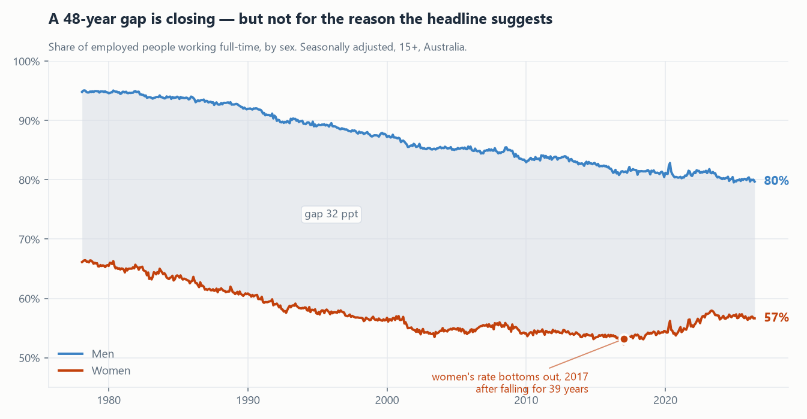
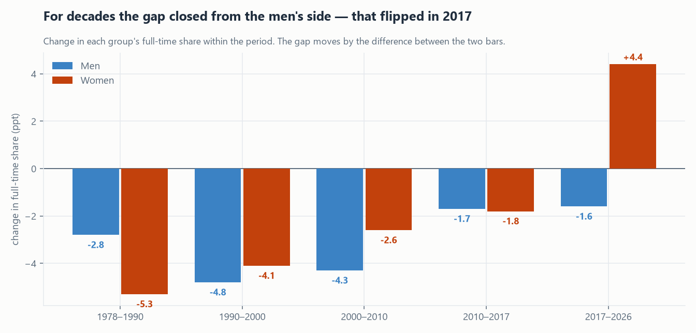
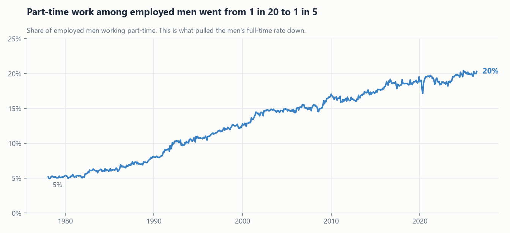
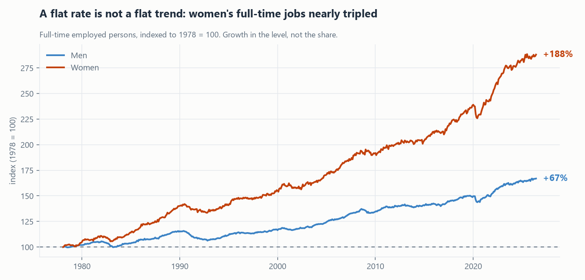

# Is Australia's gender full-time work gap closing?

**Short answer: yes, and faster than at any point in the series — but for most of
this century it was closing for the wrong reason, and that only changed in 2017.**

Analysis of ABS Labour Force data, February 1978 to June 2026 (581 months,
seasonally adjusted, persons aged 15+, Australia). Every figure below is
generated by [`scripts/analysis_gender_gap.py`](../scripts/analysis_gender_gap.py)
from the `mart.v_fulltime_parttime` model and written to
[`figures.json`](figures.json) — nothing here is typed by hand.

---

## The headline, and why it is not enough

Of employed Australians in June 2026, **79.7% of men work full-time against
56.6% of women** — a gap of **23.1 percentage points**.

That gap is narrowing. It peaked at 32.1 ppt in October 1992 and has fallen
since, with the decline accelerating sharply: −0.7 ppt per decade in the 1990s,
−1.6 in the 2000s, and **−6.6 ppt per decade since 2017**.

A dashboard could stop there. It would be reporting, and it would be misleading.



A gap can close two ways: the lower line rises, or the upper line falls. Which
one is happening changes what the number *means* entirely — and here, it changed
partway through.

## The trap: an average across a turning point

Measure from 2000 to today and the arithmetic looks damning:

| 2000 → 2026 | Change |
|---|---|
| Gap | **−7.4 ppt** |
| Men's full-time share | −7.5 ppt |
| Women's full-time share | **−0.1 ppt** |

Read that literally and **99% of the convergence came from men's full-time work
declining**, with women's rate essentially unchanged across 26 years. It is a
tidy, quotable, and wrong conclusion.

It is wrong because women's rate did not sit still. It **fell until 2017 and has
risen since**, and those two movements very nearly cancel. Averaging across the
turn erases it.

## The turning point

Smoothing the women's series with a 12-month centred average puts the trough at
**January 2017, at 53.2%** — the end of a **39-year decline** from 66.1% in
February 1978. It has since recovered **+3.5 ppt**, to 56.6%.

Splitting at that break tells a completely different story from the average:

| Period | Gap change | From men falling | From women rising |
|---|---|---|---|
| 2000 – 2017 | −1.5 ppt | 57% | 43% *(also falling)* |
| **2017 – 2026** | **−6.0 ppt** | **27%** | **73%** |



Before 2017, both rates were falling and the gap barely moved. Since 2017,
men's share fell 1.6 ppt while women's rose 4.4 ppt — the first era in the entire
series where the gap closed **because women moved into full-time work**.[^1]

So the honest answer to "is the gap closing?" is: *it is, it is closing four
times faster than in the 2000s, and only in the last nine years has it been
closing for the reason most people assume.*

## What was pulling the men's line down

Not unemployment — men's full-time share fell steadily through booms and
recessions alike. It fell because part-time work among employed men went from
rare to routine: **5.2% in 1978 to 20.3% today**, roughly one in twenty to one in
five.



This is the part of the convergence that is not good news for anyone. A gap that
narrows because the higher group is losing full-time work is a different
phenomenon from one that narrows because the lower group is gaining it — and
until 2017, Australia was mostly doing the first.

## A flat rate is not a flat trend

One more correction, because "women's full-time share was unchanged from 2000 to
2017" invites a second wrong conclusion — that women made no full-time gains.

They made enormous ones. The *rate* was flat because female employment grew so
fast that full-time and part-time grew together:

| | 1978 | 2026 | Change |
|---|---|---|---|
| Women in full-time work | 1.40 m | 4.03 m | **+188%** |
| Men in full-time work | 3.68 m | 6.14 m | +67% |
| Women's share of all full-time jobs | 27.6% | **39.6%** | +12.0 ppt |



Women's full-time employment nearly tripled while their full-time *share* fell.
Both statements are true, and reporting either one alone misleads. This is the
clearest argument in the whole dataset for never shipping a rate without its
level.

## So what

For anyone tracking labour-market equality:

1. **Never quote the gap on its own.** It moves for two opposite reasons and
   cannot distinguish them. Report both rates, and the direction each is moving.
2. **The post-2017 trend is the genuinely encouraging one** and is recent enough
   to be fragile. It deserves monitoring on its own, not as part of a 25-year
   average that hides it.
3. **Pace check.** The gap has closed at −4.6 ppt per decade since 2010. Held at
   that rate — which is an illustration of pace, not a forecast — parity arrives
   around **2076**. "Closing fast" and "closing within a working lifetime" are
   not the same claim.

## What this analysis cannot tell you

Stated plainly, because the limits matter as much as the findings:

- **It is descriptive, not causal.** I have shown *what* moved and *when*, not
  why. Plausible drivers — the ageing workforce, growth in student and semi-retired
  part-time work, industry mix shifting toward services, post-pandemic flexible
  work, childcare policy — are all untested here.
- **No compositional controls.** The extract is national totals only, with no age,
  industry, or state breakdown for the full-time/part-time split, so I cannot rule
  out that the 2017 turn reflects a change in *who is employed* rather than a
  change in the work available.
- **Voluntary and involuntary part-time are not separated.** The ABS publishes
  underemployment separately; without it, "part-time" conflates a preference with
  a constraint. This is the single most valuable extension, and the honest next
  question.
- **Trend basis differs elsewhere.** These figures are seasonally adjusted. The
  state pages of this project use the Trend series for a different and documented
  reason.

## Reproducing this

```bash
docker compose up -d
py -3 run_pipeline.py
py -3 scripts/analysis_gender_gap.py
```

The script recomputes every number, re-detects the turning point from the data
rather than assuming 2017, and rewrites the four charts and `figures.json`.

[^1]: The +4.4 ppt for 2017–2026 is measured from the January 2017 observation;
the +3.5 ppt recovery quoted earlier is measured from the 12-month centred
average at the trough, which is slightly higher than the raw monthly low. Both
are stated as computed rather than reconciled to one number.
